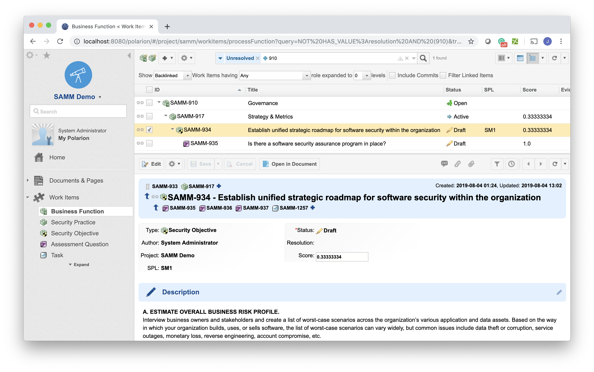
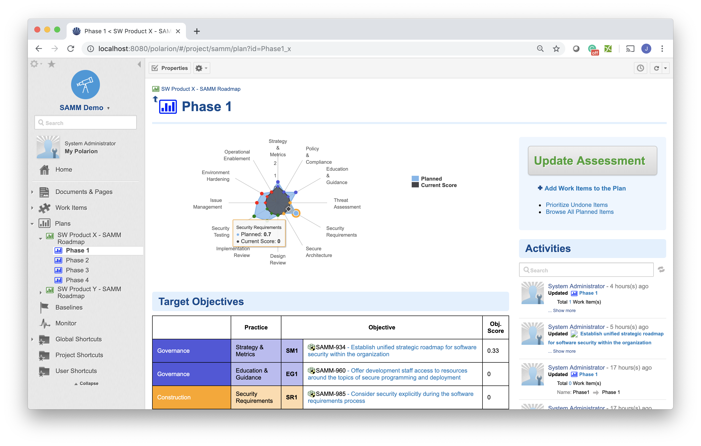
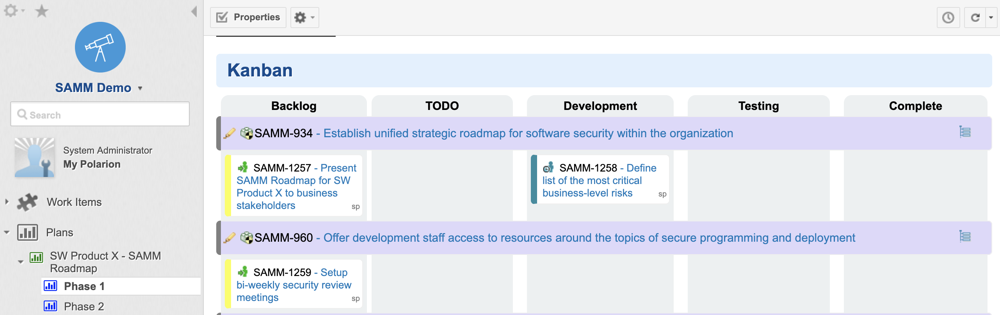
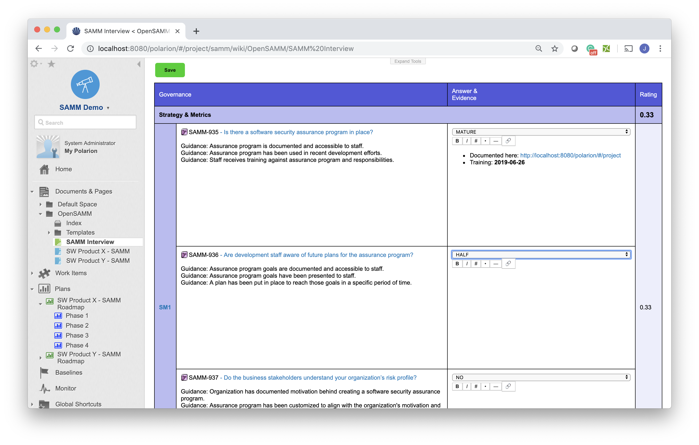

# SAMM in Polarion

A set of Polarion Extensions, Templates and Reports to enable support of Software Assurance Maturity Model (SAMM) implementation in Polarion ALM.

<a href="https://nextedy.github.io/samm/download/samm.zip">
<button class="mdc-button">Download Now!</button>
</a>

 

## Why Open SAMM
The Software Assurance Maturity Model (SAMM) is an open framework to help organizations formulate and implement a strategy for software security that is tailored to the specific risks facing the organization. The resources provided by SAMM will aid in:

* Evaluating an organization’s existing software security practices
* Building a balanced software security program in well-defined iterations
* Demonstrating concrete improvements to a security assurance program
* Defining and measuring security-related activities
within an organization

SAMM was defined with flexibility in mind such that it can be utilized by small, medium, and large organizations using any style of development. Additionally, this model can be applied organization-wide, for a single line-of-business, or even for an individual project

## Why in Polarion
Polarion embrace a similiar values: flexibility, transparency, evidence management, ...

### Flexibility
You can fully tailore the Core SAMM Model data to your specific needs, all the reports are driven by the core model.

### Auditable Reporting

As all the data are versioned and reports can be generated from any historical revisions, you can the fully auditable reporting about your assurance programm.

### Actionable
Forget about managing such a business critical domain in excel sheet. Agree on your Security Objectives (SAMM Roadmap) and track the actions as Polarion Work Items. 

### Easy to use
The **Interview Sheet** from original "Open SAMM Toolbox"  has be reimplemented as Polarion web component. You can use the same easy to use table to go through you interview process.

